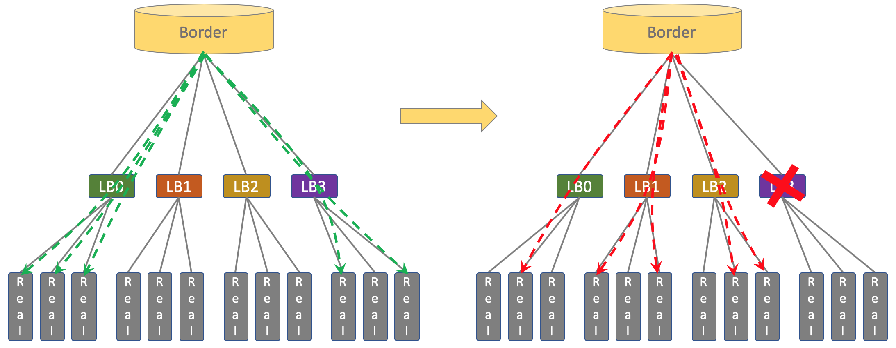
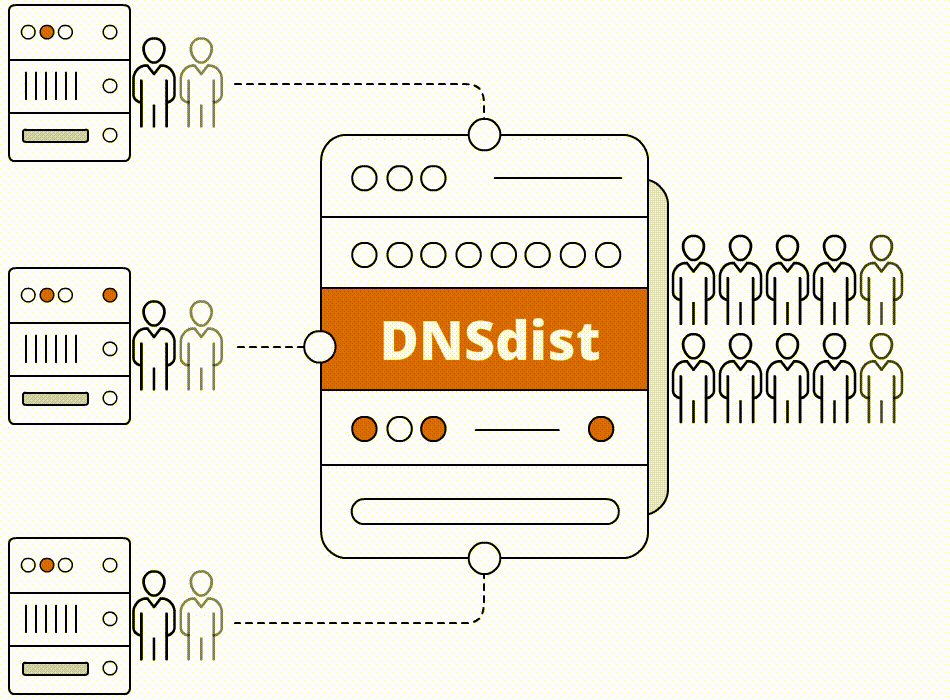
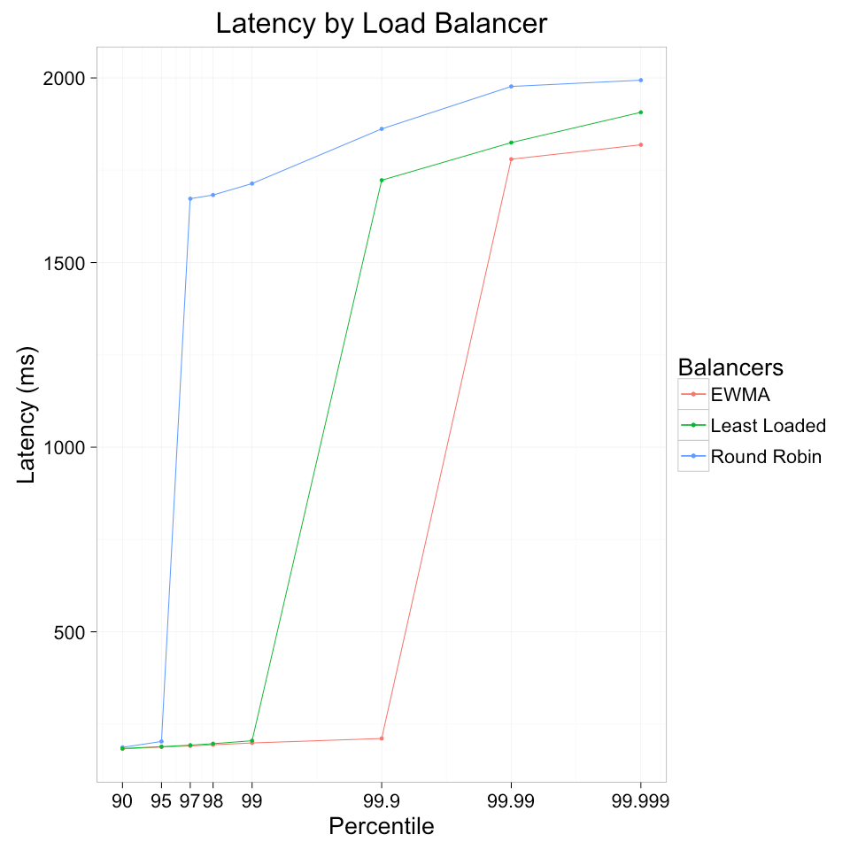
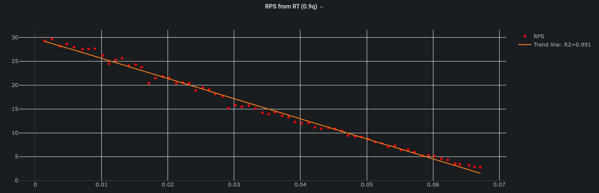

# Highload_Ozon
Расчетно-пояснительная записка к курсовой работе по дисциплине "Проектирование высоконагруженных систем"
Образовательный центр VK x МГТУ им.Н.Э.Баумана (ex. "Технопарк")

# 1. Тема и целевая аудитория
Маркетплейс Ozon - платформа, на которой продавцы могут размещать свои товары для продажи, а покупатели — приобретать их. Маркетплейс имеет широкий ассортимент товаров и предлагают удобные условия для покупки.

## Определение функционала MVP
1. Регистрация и авторизация пользователей.
2. Поиск товаров по ключевым словам.
3. Просмотр информации о товарах, включая описание, характеристики, цены и отзывы.
4. Добавление товара в корзину
5. Редактирование списка в корзине товаров.
6. Выбор пункта доставки
7. Оформление заказа
8. Выложить товар на продажу (продавец)
9. Трэккинг посылок

## Целевая аудитория
Аудитория сайта достаточно широкая и разнообразная, но, преобладающее большинство мужчины. [[1]](https://pro.similarweb.com/#/digitalsuite/websiteanalysis/overview/website-performance/*/999/1m?webSource=Total&key=ozon.ru) 
Размер целевой аудитории: 58.6 млн. пользователей в месяц, 21.0 млн. пользователей в день на момент февраля 2024г. [[2]](https://oborot.ru/news/kolichestvo-posetitelej-marketplejsov-wildberries-i-ozon-v-mesyac-sravnyalos-kuda-eshhe-hodyat-pokupateli-i209527.html) 
**Гендерное распределение**  

**Возрастное распределение**  

**География аудитории иаркетплейс Ozon** 

Можно сделать следующие выводы: 
* Преобладающее большинство пользователей мужчины
* Доминирующий возраст 25-34 года
* 95% пользователей из России

# 2. Расчёт нагрузки

## Продуктовые метрики

Метрика      | Значение
-------------| -------------
Месячная аудитория MAU        | 58.6 млн. пользователей
Дневная аудитория DAU         | 21.0 млн. пользователей
Количество регистраций в день [[3]](https://adindex.ru/news/researches/2023/02/28/310879.phtml) | 40 тыс. пользователей
Средняя длительность сессии   [[4]](https://dzen.ru/a/ZkT8wKCKkBgtJMT-) | 11 минут

### Хранилище данных для пользователя и действия пользователей
Так как общее количество заказов около 966 млн. [[5]](https://oborot.ru/news/oborot-sellerov-na-ozon-vyros-v-23-raza-skolko-u-marketplejsa-vyruchki-prodavcov-pokupatelej-i-zakazov-na-nachalo-2024-goda-i211081.html) товаров, то можно вычислить сколько в среднем один пользователь делает заказов в день:
(966 млн / 365 дней) / 21 млн = 0.13 заказа/день
Так как общее число запросов на поисковая активность в месяц около 1,007 млрд. [[6]](https://sberbusiness.live/publications/kak-pokupateli-ischut-tovar-na-marketpleisah-issledovanie-mediascope), то можно вычислить сколько в среднем один пользователь делает поисковых запросов в день:
(1,007 млрд / 30 дней) / 21 млн = 1.6 запросов/день 

Параметр          | Число
-------------| -------------
Поиск товаров по ключевым словам           | 1.6 запросов/день
Просмотр информации о товарах              | 12 [[7]](https://new-retail.ru/business/e_commerce/issledovanie_78_pokupateley_predpochitayut_izuchat_otzyvy_na_marketpleysakh/) запросов/день
Добавление товаров в корзину               | 3.1 товаров/день
Редактирование списка в корзине товаров    | 0.1 запросов/день
Выбор пункта доставки                      | 0.13 запрос/день
Оформление заказа                          | 0.13 заказов/день
Среднее количество товаров в заказе        | 3 товаров
Добавление товаров продавцом               | 0.5 товаров/день
Средний размер товара без учета фотографии | 6.3 кБ
Средний количество фотографий у товара     | 7 шт.
Средний размер фотографии товара           | 86 кБ
Трэккинг посылок                           | 0.5 запросов/день

Объём данных на одного пользователя в день:
* Добавление товаров в корзину: 3.1 товара * (6.3 кБ + 7 * 86 кБ) = 1885.7 кБ
* Оформление заказа: 3 товара * (6.3 кБ + 7 * 86 кБ) = 1824.9 кБ
* Трэккинг посылок: 0.5 запрос/день * (6.3 кБ + 86 кБ) = 46.15 кБ

Тогда общий объем товаров в день, добавляемых в корзину, оформленых в заказе, трэкинг посылок, на одного пользователя равен:
3.1 * (6.3 (кБ) + 7 * 86 (кБ)) + 3 * (6.3 (кБ) + 7 * 86 (кБ)) + 0.5 * (6.3 (кБ) + 86 (кБ)) = 3756.8 кБ = 3.8МБ

Объём данных на одного продавца в день:
* Добавление товаров продавцом: 0.5 товаров/день * (6.3 кБ + 7 * 86 кБ) = 304.2 кБ

### Динамический рост

Так как общее количество заказов около 966 млн. товаров, то можно вычислить, какой объем данных будет занят пользователями:
* Расчёт данных на товары (всего): (6.3 (кБ) + 7 * 86 (кБ)) * 966 млн. = 587.62 ТБ
* Расчёт данных только на фотографии товаров: 7 * 86 (кБ) * 966 млн. = 581.53 ТБ

### Сетевой трафик
При расчете сетевого трафика не будем учитывать запросы, связанные с регистрацией пользователей, так как они не создают ощутимую нагрузку на наш сервис.
Основная нагрузка приходится на оформление заказа, добавление в корзину, добавление товаров продавцом и трэкинг посылок.

### Предварительные расчеты:
### Трафик по видам активности на одного пользователя:
1. Поиск товаров:

* 1.6 запроса/день. Примерный объем одного запроса можно оценить в 10 кБ (запрос + ответ от сервера). Итого: 1.6 ∗ 10 кБ = 16 кБ

2. Добавление товаров в корзину:

* 3.1 товара/день. Объем данных на один товар — 3.1 * (6.3 кБ + 7 фото * 86 кБ) = 1885.7 кБ (как уже рассчитано). Итого: 1885.7 кБ

3. Оформление заказа:

* 0.13 заказ в день с 3 товарами. Итого: 3 товара * 0.13 * (6.3 кБ + 7 * 86 кБ) = 237.24 кБ. Итого: 237.24 кБ

4. Трэккинг посылок:

* 0.5 запрос/день. Примерный объем одного запроса можно оценить в 10 кБ (запрос + ответ от сервера). Итого: 0.5 * 10 = 5 кБ

5. Добавление товаров продавцом:

* 0.5 товаров/день. Примерный объем одного запроса можно оценить в 0.5 товаров/день * (6.3 кБ + 7 * 86 кБ) = 304.2 кБ. Итого: 304.2 кБ

6. Трафик на одного пользователя в день:

* 16 кБ + 1885.7 кБ + 237.24 кБ + 5 кБ = 2143.9 кБ ≈ 2.1 МБ

### Сетевой трафик по видам активности (дневная аудитория 21.0 млн. пользователей):

Пиковое значение активности пользователей(соответственно RPS тоже) приблизительно в 3 раза выше среднего значения. Возьмем коэффициент запаса равный 4

Тип                           | Отправка (дневная аудитория 21.0 млн ппокупателей и 400 тыс продавцов [[6]](https://seller.ozon.ru/media/boost/kak-izmenilsya-biznes-portret-prodavca-ozon-v-2023-godu/)) | Отправка Гб/сек     | Пиковое значение  | Значение с коэффициентом запаса 4 |
-------------                 |---------------------------------------------------------------------------------------------------------------------------------------------------------------------------|---------------------|-------------------|-----------------------------------|
Поиск товаров                 | 21.0 млн * 16 кБ = 336 ГБ                                                                                                                                                 | 0.0039              | 0.0117            | 0.0156                            |
Добавление товаров в корзину  | 21.0 млн * 1885.7 кБ = 39 600 ГБ                                                                                                                                          | 0.458               | 1.374             | 1.832                             |
Оформление заказа             | 21.0 млн * 237.24 кБ = 4 982 ГБ                                                                                                                                           | 0.058               | 0.174             | 0.232                             |
Трэккинг посылок              | 21.0 млн * 5 кБ = 105 ГБ                                                                                                                                                  | 0.0012              | 0.0036            | 0.0048                            |
Добавление товаров продавцом  | 0.4 млн * 304.2 кБ = 121.7 ГБ                                                                                                                                             | 0.0014              | 0.0042            | 0.0056                            |
Итого                         | Покупатель: 45 023 ГБ ≈ 45 ТБ     Продавец: 121.7 ГБ                                                                                                                  | 0.519   0.0014  | 1.56   0.0042 | 2.08   0.0056                 |

### RPS
* Регистрация и авторизация пользователей: 40 тыс / 86400 = 0.5 RPS
* Поиск товаров: 21.0 млн * 1.6 / 86400 = 388.9 RPS
* Просмотр информации о товарах: 21.0 млн * 12 / 86400 = 2 917 RPS
* Добавление товаров в корзину: 21.0 млн * 3.1 / 86400 = 753.5 RPS
* Редактирование списка в корзине товаров: 21.0 млн * 0.1 / 86400 = 24.3 RPS
* Выбор пункта доставки: 21.0 млн * 0.13 / 86400 = 31.6 RPS
* Оформление заказов: 21.0 млн. * 0.13 / 86400 = 31.6 RPS
* Трэккинг посылок: 21.0 млн. * 0.5 / 86400 = 121.5 RPS
* Добавление товаров продавцом: 21.0 млн. * 0.5 / 86400 = 121.5 RPS

Действие                                | RPS        | Пиковое значение | Пиковое значение с коэффициентом запаса 4 |
------------------------------------    |------------|------------------|-------------------------------------------|
Регистрация и авторизация пользователей | 1          | 3                | 4                                         |
Поиск товаров                           | 388.9      | 1 166.7          | 1 555.6                                   |
Просмотр информации о товарах           | 2 917      | 8 751            | 11 668                                    |
Добавление товаров в корзину            | 753.5      | 2 260.5          | 3 014                                     |
Редактирование списка в корзине товаров | 24.3       | 72.9             | 97.2                                      |
Выбор пункта доставки                   | 31.6       | 94.8             | 126.4                                     |
Оформление заказов                      | 31.6       | 94.8             | 126.4                                     |
Трэкинг посылок                         | 121.5      | 364.5            | 486                                       |
Добавление товаров продавцом            | 121.5      | 364.5            | 486                                       |
**Итого**                               | 4390   | 13 171           | 17 561                                    |

# 3. Глобальная балансировка

### Разбиение по доменам

Будем считать, что домены по типу www.ozon.com работает на раздачу фронтенда, а бекенд распределён по поддоменам, которые будут рассмотрены далее.

- **ozon.ru**  
  Основной домен для российского сегмента Ozon, предоставляющий доступ к основному функционалу платформы.  
  
- **ozon.com**  
  Домен для международной версии Ozon, ориентированной на аудиторию за пределами России.  
  
- **ozon.kz**  
  Домен для казахстанского сегмента Ozon, адаптированный под особенности местного рынка.  
  
- **ozon.by**  
  Домен для белорусского сегмента Ozon, адаптированный под потребности белорусского рынка.  
  

### Расположение ЦОДов
Ozon работает в несккольких странах, поэтому ЦОДы не следует сосредотачивать в одной стране. Тем не менее, объём трафика из разных регионов сильно различается. Чтобы определить основных потребителей трафика, стоит обратиться с скриншотам выше.
Большой объём трафика приходится на домен ozon.ru, это около 412.7 / (412.7 + 1.103 + 14.18 + 6.611) * 100% = 95%. Следовательно расположение ЦОДов будем определять преимущественно в России.

Таким образом получаем, что ЦОДы можно расположить в следующих локациях:

- Москва
- Санкт-Петербург
- Ростов-на-Дону
- Иркутск

Посмотреть на интерактивной карте: https://yandex.ru/maps/?um=constructor%3Ad1104bd74ccac98183303bb820f37407d2142a6cde52aefb09563453659e8e32&source=constructorLink
Крат магистральных путей России: https://www.comnews.ru/content/211042/2020-10-21/2020-w43/magistralnye-seti-svyazi-rossii
Карта население России: https://worldpopulationreview.com/countries/russia 
Список был составлен на основе не только основных потребителей трафика, но и основных точек присутствия провайдеров и подводных магистральных сетей. Нужно понимать, что разные сервера могут держать на себе различные сервисы. Так, список выше подходит для размещения серверов с основной логикой платформы; для CDN же этот список стоит значительно расширить, но в рамках работы будем считать, что CDN расположены там же.
Таким образом, при таком списке мы получим снижение латентности и улучшим доступность платформы.

### Схема DNS-балансировки
Так как сервис находится преимущественно в рамках одной страны, то в качетсве балансировки будет использоваться роутинг. За счёт географических масштабов проекта здесь будет применяться GeoDNS
В итоге, клиентский трафик заводится в 4 ЦОД через BGP Anycast. Далее посредством Equal-cost multi-path routing (ECMP) попадает на несколько LoadBalancer c защитой от DNS- и DoS-атак. ECMP роутинг может использоваться в сочетании с BGP, использования этой стратегии маршрутизации, при которой пакеты пересылаются по нескольким «лучшим путям», увеличивает пропускную способность сети.

# 3. Локальная балансировка

### Cервис разрешения доменных имен (DNS), Service Discovery

Пройдя глобальную балансировку, трафик посредством стратегии **ECMP** — многопутевой маршрутизации с равной стоимостью — попадает на несколько LoadBalancer. **ECMP** потенциально предлагает существенное увеличение пропускной способности за счет балансировки нагрузки по нескольким каналам. А **BGP**, в свою очередь, поддерживает **ECMP** роутинг. Таким образом точками входа клиентского трафика являеются машины с LoadBalancer, которые имеют единый **Virtual IP**. После них DNS-запрос от LoadBalancer направляется на пул локальных real-серверов, заранее прописанный в конфиге Caching DNS сервер (Resolver, рекурсивный преобразователь). Resolver сервер получает информацию от авторитетного (Authoritative) сервера и кеширут её локально с заданным **TTL**. [Политика выбора](https://dnsdist.org/guides/serverselection.html) real-сервера для поступившего запроса — Round-Robin DNS.

### Failover
В случае проблем на одной из LoadBalancer **BGP**-анонс его **Virtual IP** прекращается, таблицы маршрутизации перестраиваются, клиенты идут на оставшиеся балансировщики.
В случае недоступности Resolver и Authoritative DNS сервера, запросы идут Resolver и Authoritative DNS сервера находящийся в одном из соседних **ЦОД**.

### Технологии [[8]](https://www.cisco.com/c/en/us/td/docs/ios-xml/ios/mp_l3_vpns/configuration/xe-3s/asr903/16-12-1/b-mpls-l3-vpns-xe-16-12-asr900/b-mpls-l3-vpns-xe-16-11-asr900_chapter_0101.pdf)

В качестве LoadBalancer выберем L7 Dnsdist по следующим причинам: есть поддержка Resolver и Authoritative, L7 позволяет интегрировать дополнительную логику, защита от DNS- и DoS-атак, умеет лимитировать клиентов по DNS запросу и по IP.

У L4 балансеров по типу Haproxy есть недостатки, которые заключаются в том, что теряется source IP клиента. А работающие на уровне ядра (Kernelspace) L4 балансеры сложны в конфигурации.

Т.к. Dnsdist является продуктом PowerDNS, выберем решения от той же компании. Resolver сервер — PowerDNS Recursor, Authoritative — PowerDNS Auth. DNS записи ресурсов будем хранить в Generic Postgresql Backend, эта DB позволяет кешировать и обновалять зоны. Редактировать DNS записи будем через PowerDNS-Admin.

### API Gateway
Далее после real-DNS-серверов трафки направляется в API-шлюз.
API-шлюз выступает как единая точка входа в ЦОД, отвечает за вертикальный(*north-south*) трафик.
Выполняет следующие задачи:
* Абстрагирует сложности микросервисов и предлагает клиентам единообразный интерфейс для взаимодействия, GRPC Routing.
* Терминирует клиенский TLS, с внутренними сервисами общаться через mutual TLS.
* Обрабатывает аутентификацию и передаёт сервисам информацию о токенах, например, проверяет действительный ли JWT, прежде чем направить запрос во внутреннюю службу, распределяет нагрузку на конечную внутреннюю службу.
* Регулирует входящий и исходящий трафик, ставит глобальный и локальные Rate Limit,  устанавливает политику ретраев, осуществляет трассировка запросов, отдаёт Gateway API Metrics в Prometheus, observability в ControlPlane.

Возможные варианты реализации: [[9]](https://www.cncf.io/blog/2023/03/15/linkerd-and-ingress-controllers-bringing-the-outside-world-in/)
* **Emissary-ingress** – это API-шлюз с открытым исходным кодом, разработанный для Kubernetes. Этот проект CNCF появился в 2017 году.
* **NGINX** —  это API-шлюз, который фактически предшествует Kubernetes и послужил основой для одного из первых контроллеров входящего трафика Kubernetes, называемого ingress-nginx. **NGINX** старее следующего конкурента  —  **Envoy Gateway**
* **Envoy Gateway** — это совершенно новый ingress controller. Это часть проекта CNCF Envoy-proxy, который является ядром двух отдельных CNCF API gateways (Emissary и Contour). В 2021 году разработчики из Emissary, Contour и Envoy собрались вместе и решили, что всем заинтересованным сторонам было бы лучше объединить свои усилия в единой расширяемой системе Envoy Gateway, которая будет выпущена в конце 2022 года.

Многие варианты API-шлюзов подходят под нашу архитектуру, выберем **Envoy Gateway** как самый передовой из них.

### Service Mesh

Исходишь трафик от API Gateway попадает в сервисную сеть, где принимается прокси-сайдкаром в целевом поде.

Service Mesh обеспечиваeт ряд преимуществ:
* Security: Поддержка автоматического шифрования — mutual TLS.
* Continuous Delivery: Доступность сложных шаблонов трафика, например, канареечный деплой, A / B-тестирования.
* Observability: tracing трафика.

Есть два наиболее популярных подхода реализации инфраструктурного слоя сервисной сетки:
* ***Envoy + Istio*** [[10]](https://www.kubecost.com/kubernetes-devops-tools/istio-envoy/)
* ***Linkerd*** [[11]](https://linkerd.io/)

               

### Различия и выбор между Istio и Linkerd

* Сайдкар контейнером у Istio служит Envoy, которые не поддерживает *PeakEWMA*.
*  Istio имеет обширным набором функций, что делает его более гибким, но и более сложным в настройке и управлении. Linkerd ориентирован на простоту и удобство использования.
* Linkerd имеет легкие и быстрые прокси-сервера, что обеспечивает меньшее использование ресурсов и более высокую производительность по сравнению с Istio.

Расположить везде сайдкарт контейнеры в большой системе  довольно дорого, поэтому производительность прокси-сервера имеет не малую роль. Для балансируют нагрузку на соединения более высокого уровня, такие как вызовы RPC или HTTP существуют возможные алгоритмы балансировки: *Weight round robin*, *Consistent Hash*, *Least Connected* и *PeakEWMA*.
Алгоритм *PeakEWMA* довольно эффективен, он поддерживается только в Finagle и Linkerd. По итогу выбираем Linkerd.

### Эффективный *_PeakEWMA_*

Принцип действия: рассчитываем скользящее среднее времени длительности запросов и, исходя из этого, выбираем бэкенд, на который вышлем нагрузку.
Данный алгоритм использует концепцию экспоненциально взвешенных скользящих средних для определения «пиковой» нагрузки серверов.
Присваивая веса недавним измерениям трафика, он точно фиксирует текущую нагрузку сервера и динамически корректирует свой выбор для входящих запросов.

На графике предствален эксперимент с тремя алгоритмами: round robin, least loaded, and peak exponentially-weighted moving average (“peakEWMA”)

В Ozon пошли дальше и вместо сайдкар контейнеров написали свою кастомную реализацию data panel поверх "гошного" gRPS, сохранив для разработчиков семантику библиотечных вызовов. Назвали свой Service Mesh — Warder. Этим они избавились от затраты ресурсов на сайдкар контейнеры. Протестировав все алгоритмы балансировки в своей инфраструктуре, *PeakEWMA* показал наилучшии метрики при тестах, он обеспечивает лучшую связь между RPS и RT (Response Time). [[13]](https://linkerd.io/2016/03/16/beyond-round-robin-load-balancing-for-latency/)

# Список источников

1. https://pro.similarweb.com/#/digitalsuite/websiteanalysis/overview/website-performance/*/999/1m?webSource=Total&key=ozon.ru
2. https://oborot.ru/news/kolichestvo-posetitelej-marketplejsov-wildberries-i-ozon-v-mesyac-sravnyalos-kuda-eshhe-hodyat-pokupateli-i209527.html
3. https://adindex.ru/news/researches/2023/02/28/310879.phtml
4. https://dzen.ru/a/ZkT8wKCKkBgtJMT-
5. https://oborot.ru/news/oborot-sellerov-na-ozon-vyros-v-23-raza-skolko-u-marketplejsa-vyruchki-prodavcov-pokupatelej-i-zakazov-na-nachalo-2024-goda-i211081.html
6. https://sberbusiness.live/publications/kak-pokupateli-ischut-tovar-na-marketpleisah-issledovanie-mediascope
7. https://new-retail.ru/business/e_commerce/issledovanie_78_pokupateley_predpochitayut_izuchat_otzyvy_na_marketpleysakh/
8. https://www.cisco.com/c/en/us/td/docs/ios-xml/ios/mp_l3_vpns/configuration/xe-3s/asr903/16-12-1/b-mpls-l3-vpns-xe-16-12-asr900/b-mpls-l3-vpns-xe-16-11-asr900_chapter_0101.pdf
9. https://www.cncf.io/blog/2023/03/15/linkerd-and-ingress-controllers-bringing-the-outside-world-in/
10. https://www.kubecost.com/kubernetes-devops-tools/istio-envoy/
11. https://linkerd.io/
12. https://linkerd.io/2016/03/16/beyond-round-robin-load-balancing-for-latency/