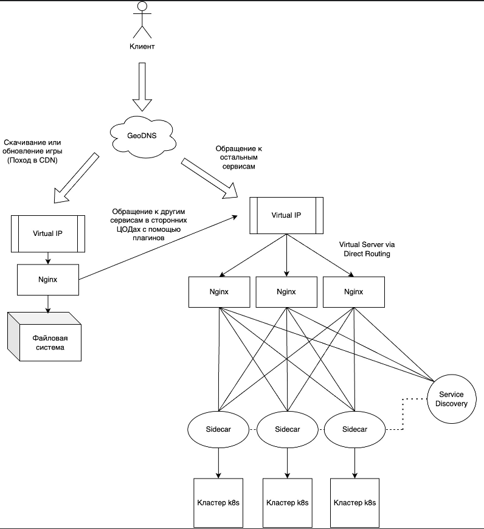
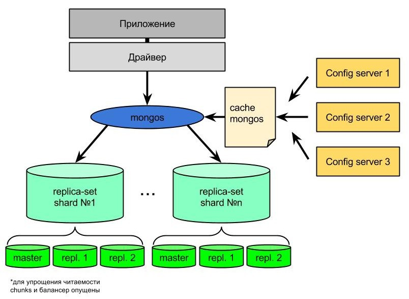

# Highload_Ozon
Расчетно-пояснительная записка к курсовой работе по дисциплине "Проектирование высоконагруженных систем"
Образовательный центр VK x МГТУ им.Н.Э.Баумана (ex. "Технопарк")
# Содержание

### 1. [Тема, целевая аудитория](#1)
### 2. [Расчет нагрузки](#2)
### 3. [Глобальная балансировка нагрузки](#3)
### 4. [Локальная балансировка нагрузки](#4)
### 5. [Логическая схема БД](#5)
### 6. [Физическая схема БД](#6)
### 7. [Алгоритмы](#7)
### [Список источников](#list_of_sources)

# <a name="1"></a> 1. Тема и целевая аудитория
Маркетплейс Ozon - платформа, на которой продавцы могут размещать свои товары для продажи, а покупатели — приобретать их. Маркетплейс имеет широкий ассортимент товаров и предлагают удобные условия для покупки.

## Определение функционала MVP
1. Регистрация и авторизация пользователей.
2. Поиск товаров по ключевым словам.
3. Просмотр информации о товарах, включая описание, характеристики, цены и отзывы.
4. Добавление товара в корзину
5. Редактирование списка в корзине товаров.
6. Выбор пункта доставки
7. Оформление заказа
8. Выложить товар на продажу (продавец)
9. Трэккинг посылок

## Целевая аудитория
Аудитория сайта достаточно широкая и разнообразная, но, преобладающее большинство мужчины. [[1]](https://pro.similarweb.com/#/digitalsuite/websiteanalysis/overview/website-performance/*/999/1m?webSource=Total&key=ozon.ru)<br/>
Размер целевой аудитории: 58.6 млн. пользователей в месяц, 21.0 млн. пользователей в день на момент февраля 2024г. [[2]](https://oborot.ru/news/kolichestvo-posetitelej-marketplejsov-wildberries-i-ozon-v-mesyac-sravnyalos-kuda-eshhe-hodyat-pokupateli-i209527.html)<br/>
**Гендерное распределение** <br/>


**Возрастное распределение** <br/>


**География аудитории иаркетплейс Ozon**<br/>

Можно сделать следующие выводы: 
* Преобладающее большинство пользователей мужчины
* Доминирующий возраст 25-34 года
* 95% пользователей из России

# <a name="2"></a> 2. Расчёт нагрузки

## Продуктовые метрики

Метрика      | Значение
-------------| -------------
Месячная аудитория MAU        | 58.6 млн. пользователей
Дневная аудитория DAU         | 21.0 млн. пользователей
Количество регистраций в день [[3]](https://adindex.ru/news/researches/2023/02/28/310879.phtml) | 40 тыс. пользователей
Средняя длительность сессии   [[4]](https://dzen.ru/a/ZkT8wKCKkBgtJMT-) | 11 минут

### Хранилище данных для пользователя и действия пользователей
Так как общее количество заказов около 966 млн. [[5]](https://oborot.ru/news/oborot-sellerov-na-ozon-vyros-v-23-raza-skolko-u-marketplejsa-vyruchki-prodavcov-pokupatelej-i-zakazov-na-nachalo-2024-goda-i211081.html) товаров, то можно вычислить сколько в среднем один пользователь делает заказов в день:
(966 млн / 365 дней) / 21 млн = 0.13 заказа/день
Так как общее число запросов на поисковая активность в месяц около 1,007 млрд. [[6]](https://sberbusiness.live/publications/kak-pokupateli-ischut-tovar-na-marketpleisah-issledovanie-mediascope), то можно вычислить сколько в среднем один пользователь делает поисковых запросов в день:
(1,007 млрд / 30 дней) / 21 млн = 1.6 запросов/день 

Параметр          | Число
-------------| -------------
Поиск товаров по ключевым словам           | 1.6 запросов/день
Просмотр информации о товарах              | 12 [[7]](https://new-retail.ru/business/e_commerce/issledovanie_78_pokupateley_predpochitayut_izuchat_otzyvy_na_marketpleysakh/) запросов/день
Добавление товаров в корзину               | 3.1 товаров/день
Редактирование списка в корзине товаров    | 0.1 запросов/день
Выбор пункта доставки                      | 0.13 запрос/день
Оформление заказа                          | 0.13 заказов/день
Среднее количество товаров в заказе        | 3 товаров
Добавление товаров продавцом               | 0.5 товаров/день
Средний размер товара без учета фотографии | 6.3 кБ
Средний количество фотографий у товара     | 7 шт.
Средний размер фотографии товара           | 86 кБ
Трэккинг посылок                           | 0.5 запросов/день

Объём данных на одного пользователя в день:
* Добавление товаров в корзину: 3.1 товара * (6.3 кБ + 7 * 86 кБ) = 1885.7 кБ
* Оформление заказа: 3 товара * (6.3 кБ + 7 * 86 кБ) = 1824.9 кБ
* Трэккинг посылок: 0.5 запрос/день * (6.3 кБ + 86 кБ) = 46.15 кБ

Тогда общий объем товаров в день, добавляемых в корзину, оформленых в заказе, трэкинг посылок, на одного пользователя равен:
3.1 * (6.3 (кБ) + 7 * 86 (кБ)) + 3 * (6.3 (кБ) + 7 * 86 (кБ)) + 0.5 * (6.3 (кБ) + 86 (кБ)) = 3756.8 кБ = 3.8МБ

Объём данных на одного продавца в день:
* Добавление товаров продавцом: 0.5 товаров/день * (6.3 кБ + 7 * 86 кБ) = 304.2 кБ

### Динамический рост

Так как общее количество заказов около 966 млн. товаров, то можно вычислить, какой объем данных будет занят пользователями:
* Расчёт данных на товары (всего): (6.3 (кБ) + 7 * 86 (кБ)) * 966 млн. = 587.62 ТБ
* Расчёт данных только на фотографии товаров: 7 * 86 (кБ) * 966 млн. = 581.53 ТБ

### Сетевой трафик
При расчете сетевого трафика не будем учитывать запросы, связанные с регистрацией пользователей, так как они не создают ощутимую нагрузку на наш сервис.
Основная нагрузка приходится на оформление заказа, добавление в корзину, добавление товаров продавцом и трэкинг посылок.

### Предварительные расчеты:
### Трафик по видам активности на одного пользователя:
1. Поиск товаров:

* 1.6 запроса/день. Примерный объем одного запроса можно оценить в 10 кБ (запрос + ответ от сервера). Итого: 1.6 ∗ 10 кБ = 16 кБ

2. Добавление товаров в корзину:

* 3.1 товара/день. Объем данных на один товар — 3.1 * (6.3 кБ + 7 фото * 86 кБ) = 1885.7 кБ (как уже рассчитано). Итого: 1885.7 кБ

3. Оформление заказа:

* 0.13 заказ в день с 3 товарами. Итого: 3 товара * 0.13 * (6.3 кБ + 7 * 86 кБ) = 237.24 кБ. Итого: 237.24 кБ

4. Трэккинг посылок:

* 0.5 запрос/день. Примерный объем одного запроса можно оценить в 10 кБ (запрос + ответ от сервера). Итого: 0.5 * 10 = 5 кБ

5. Добавление товаров продавцом:

* 0.5 товаров/день. Примерный объем одного запроса можно оценить в 0.5 товаров/день * (6.3 кБ + 7 * 86 кБ) = 304.2 кБ. Итого: 304.2 кБ

6. Трафик на одного пользователя в день:

* 16 кБ + 1885.7 кБ + 237.24 кБ + 5 кБ = 2143.9 кБ ≈ 2.1 МБ

### Сетевой трафик по видам активности (дневная аудитория 21.0 млн. пользователей):

Пиковое значение активности пользователей(соответственно RPS тоже) приблизительно в 3 раза выше среднего значения. Возьмем коэффициент запаса равный 4

Тип                           | Отправка (дневная аудитория 21.0 млн ппокупателей и 400 тыс продавцов [[6]](https://seller.ozon.ru/media/boost/kak-izmenilsya-biznes-portret-prodavca-ozon-v-2023-godu/)) | Отправка Гб/сек     | Пиковое значение  | Значение с коэффициентом запаса 4 |
-------------                 |---------------------------------------------------------------------------------------------------------------------------------------------------------------------------|---------------------|-------------------|-----------------------------------|
Поиск товаров                 | 21.0 млн * 16 кБ = 336 ГБ                                                                                                                                                 | 0.0039              | 0.0117            | 0.0156                            |
Добавление товаров в корзину  | 21.0 млн * 1885.7 кБ = 39 600 ГБ                                                                                                                                          | 0.458               | 1.374             | 1.832                             |
Оформление заказа             | 21.0 млн * 237.24 кБ = 4 982 ГБ                                                                                                                                           | 0.058               | 0.174             | 0.232                             |
Трэккинг посылок              | 21.0 млн * 5 кБ = 105 ГБ                                                                                                                                                  | 0.0012              | 0.0036            | 0.0048                            |
Добавление товаров продавцом  | 0.4 млн * 304.2 кБ = 121.7 ГБ                                                                                                                                             | 0.0014              | 0.0042            | 0.0056                            |
Итого                         | Покупатель: 45 023 ГБ ≈ 45 ТБ  <br/>  Продавец: 121.7 ГБ                                                                                                                  | 0.519 <br/> 0.0014  | 1.56 <br/> 0.0042 | 2.08 <br/> 0.0056                 |

### RPS
* Регистрация и авторизация пользователей: 40 тыс / 86400 = 0.5 RPS
* Поиск товаров: 21.0 млн * 1.6 / 86400 = 388.9 RPS
* Просмотр информации о товарах: 21.0 млн * 12 / 86400 = 2 917 RPS
* Добавление товаров в корзину: 21.0 млн * 3.1 / 86400 = 753.5 RPS
* Редактирование списка в корзине товаров: 21.0 млн * 0.1 / 86400 = 24.3 RPS
* Выбор пункта доставки: 21.0 млн * 0.13 / 86400 = 31.6 RPS
* Оформление заказов: 21.0 млн. * 0.13 / 86400 = 31.6 RPS
* Трэккинг посылок: 21.0 млн. * 0.5 / 86400 = 121.5 RPS
* Добавление товаров продавцом: 21.0 млн. * 0.5 / 86400 = 121.5 RPS

Действие                                | RPS        | Пиковое значение | Пиковое значение с коэффициентом запаса 4 |
------------------------------------    |------------|------------------|-------------------------------------------|
Регистрация и авторизация пользователей | 1          | 3                | 4                                         |
Поиск товаров                           | 388.9      | 1 166.7          | 1 555.6                                   |
Просмотр информации о товарах           | 2 917      | 8 751            | 11 668                                    |
Добавление товаров в корзину            | 753.5      | 2 260.5          | 3 014                                     |
Редактирование списка в корзине товаров | 24.3       | 72.9             | 97.2                                      |
Выбор пункта доставки                   | 31.6       | 94.8             | 126.4                                     |
Оформление заказов                      | 31.6       | 94.8             | 126.4                                     |
Трэкинг посылок                         | 121.5      | 364.5            | 486                                       |
Добавление товаров продавцом            | 121.5      | 364.5            | 486                                       |
**Итого**                               | 4390 <br/> | 13 171           | 17 561                                    |

# <a name="3"></a> 3. Глобальная балансировка

### Разбиение по доменам

Будем считать, что домены по типу www.ozon.com работает на раздачу фронтенда, а бекенд распределён по поддоменам, которые будут рассмотрены далее.

- **ozon.ru** <br/>
  Основной домен для российского сегмента Ozon, предоставляющий доступ к основному функционалу платформы. <br/>
  
- **ozon.com** <br/>
  Домен для международной версии Ozon, ориентированной на аудиторию за пределами России. <br/>
  
- **ozon.kz** <br/>
  Домен для казахстанского сегмента Ozon, адаптированный под особенности местного рынка. <br/>
  
- **ozon.by** <br/>
  Домен для белорусского сегмента Ozon, адаптированный под потребности белорусского рынка. <br/>
  

### Расположение ЦОДов
Ozon работает в несккольких странах, поэтому ЦОДы не следует сосредотачивать в одной стране. Тем не менее, объём трафика из разных регионов сильно различается. Чтобы определить основных потребителей трафика, стоит обратиться с скриншотам выше.
Большой объём трафика приходится на домен ozon.ru, это около 412.7 / (412.7 + 1.103 + 14.18 + 6.611) * 100% = 95%. Следовательно расположение ЦОДов будем определять преимущественно в России.

Таким образом получаем, что ЦОДы можно расположить в следующих локациях:

- Москва
- Санкт-Петербург
- Ростов-на-Дону
- Иркутск

Посмотреть на интерактивной карте: https://yandex.ru/maps/?um=constructor%3Ad1104bd74ccac98183303bb820f37407d2142a6cde52aefb09563453659e8e32&source=constructorLink
Крат магистральных путей России: https://www.comnews.ru/content/211042/2020-10-21/2020-w43/magistralnye-seti-svyazi-rossii
Карта население России: https://worldpopulationreview.com/countries/russia 
Список был составлен на основе не только основных потребителей трафика, но и основных точек присутствия провайдеров и подводных магистральных сетей. Нужно понимать, что разные сервера могут держать на себе различные сервисы. Так, список выше подходит для размещения серверов с основной логикой платформы; для CDN же этот список стоит значительно расширить, но в рамках работы будем считать, что CDN расположены там же.
Таким образом, при таком списке мы получим снижение латентности и улучшим доступность платформы.

### Схема DNS-балансировки
Так как сервис находится преимущественно в рамках одной страны, то в качетсве балансировки будет использоваться роутинг. За счёт географических масштабов проекта здесь будет применяться GeoDNS
В итоге, клиентский трафик заводится в 4 ЦОД через BGP Anycast. Далее посредством Equal-cost multi-path routing (ECMP) попадает на несколько LoadBalancer c защитой от DNS- и DoS-атак. ECMP роутинг может использоваться в сочетании с BGP, использования этой стратегии маршрутизации, при которой пакеты пересылаются по нескольким «лучшим путям», увеличивает пропускную способность сети.

# <a name="4"></a> 4. Локальная балансировка

### Рассмотрим настоящую архитектуру Ozon [[13]](https://habr.com/ru/companies/ozontech/articles/558926/):
Согласно докладу разработчиков из Ozon, их система балансировки нагрузки устроена следующим образом:
1. Уровень GeoDNS-балансировки - используется для распределения трафика между несколькими дата-центрами
2. Уровень L4-балансировки - используется внутри каждого дата-центра для распределения трафика между серверами. Основано на использовании программных балансировщиков на базе NGINX.
3. Уровень L7-балансировки - применяется для распределения трафика между различными сервисами внутри Ozon. Реализовано на базе программных балансировщиков NGINX.
Для системы, в которой все построенно на микросервисах, такой подход более чем оправдан. В итоге получается такая схема работы:
<p align="center">
  
  
</p>


### Рассмотрим несколько балансировок [[14]](https://habr.com/ru/companies/vk/articles/347026/)
* DNS-балансировка: имеет низкую нагрузку на сеть, но не подходит из-за высокой вероятности длительных соединений и необходимости быстрой реакции на изменения в инфраструктуре
* L4-балансировка: может использоваться для базовой балансировки, но не подходит для сложных сценариев, так как имеет ограниченные возможности по управлению сессиями, также нет поддержки сложных протоколов
* L7-балансировка: наиболее подходящий вариант для маркетплейма Ozon. Позволяет эффективно распределять нагрузку, управлять сессиями пользователей, оптимизировать трафик и реализовать дополнительные функциональные возможности, однако из минусов есть высокая сложность настройки и потенциально более низкая производительность.

### Выбранный способ балансировки
На уровне локальной балансировки будем использовать только L7 балансировку. В архитектуре не будет использоваться L4, так как в данном сценарии этот уровень избыточен. L7 балансировку будем использовать два веб-сервера Nginx для отказоустойчивости (паттерн Active-Passive). <br/>
Вывод: L7-балансировка. Для Ozon, как крупного маркетплейса с высокой нагрузкой и сложной архитектурой приложения, наиболее подходящим вариантом будет L7-балансировка. Она предоставляет необходимую гибкость, возможность учета особенностей приложения и реализации сложных сценариев маршрутизации трафика. L7-балансировщик позволяет привязывать пользователя к определенному серверу, обеспечивая более стабильное соединение и упрощая обработку контекста пользователя. Также часто используемые данные могут быть кэшированы на уровне балансировщика, что снижает нагрузку на бэкенд-серверы и ускоряет ответ. К тому же L7 балансировщики хорошо интегрируются с Kubernetes.

### Методы балансировки нагрузки [[15]](https://timeweb.cloud/tutorials/servers/kak-nastroit-balansirovku-nagruzki-s-pomoshchyu-nginx)
Популярные алгоритмы распределения трафика: <br/>
 <br/>
Выбор: Round Robin. Так как это простой и легковесный алгоритм + легко масштабируется.
* ### Алгоритм Round Robin
Существует довольно много методов балансировки. Nginx по умолчанию использует алгоритм Round Robin. Он довольно прост. Допустим, у нас есть приложения 1, 2 и 3. Балансировщик нагрузки отправит первый запрос на первое приложение, потом на второе, на третье и опять на первое

1 запрос                | 2 запрос                | 3 запрос                  | 4 запрос
----------------------- |-------------------------|---------------------------| ---
 |  |    | 

<br/>Чтобы избежать простоя серверов, можно использовать некоторый числовой приоритет. У каждого сервера появляется свой вес, который определяет, как много трафика распределяется на конкретный экземпляр приложения. Таким образом мы гарантируем, что более мощные серверы получат больше трафика.

### Схема отказоустойчивости

Для отказоустойчивости будут применяться инструменты k8s и nginx. Kubernetes с помощью readiness-проб обеспечит исключение из кластера упавших подов и добавление новых, а также сможет автоматически поднимать упавшие сервера. Если предположить, что ЦОДы будут не нашими, а арендованными, то kubernetes также позволит выполнять удобный auto-scaling, чтобы подстраиваться под актуальную нагрузку. Nginx умеет выполнять retry запросов после падения бэкенда, перезапускать web-сервера без downtime (хотя при использовании k8s это избыточно), равномерно распределять запросы по бэкендам, а также незаметно для пользователя перезагружать конфиг при обновлениях.

### Нагрузка по терминации SSL [[16]](https://www.ibm.com/docs/en/cics-ts/6.x?topic=performance-ssl-handshake-overhead)

На современных серверах ssl handshake может занимать от 2 мс при сокращённом рукопожатии до 20 мс при полном рукопожатии 13, при этом это время полного ответа, в то время как сами вычисления на процессоре занимают 0.5 - 0.6 мс. При последующих расчётах будем считать, что ssl handshake занимает 3 мс, т.к. мы будет использовать сокращённые рукопожатия в nginx, то есть сервер и клиент будут согласны на переиспользование защищённой сессии, которую использовали ранее (session tickets).

В таком случае, исходя из пикового RPS по всем основным ручкам (4390 RPS) получаем, что на обработку SSL каждую секунду потребуется 4390 * 3 = 13 170 мс = 13 секунд вычислительного времени.

# <a name="5"></a> 5. Логическая схема БД


<br/>Вы можете перейти по ссылке чтобы подробнее изучить схему бд: https://drawsql.app/teams/sergey-20/diagrams/highload-ozon-db

| Type       | Byte size     |
|------------|---------------|
| UUID       | 16            |      
| INT        | 4             |
| SMALLINT   | 2             |
| TIMESTAMP  | 4             |
| DECIMAL    | 17            |
| TEXT       | [0, 65 535]   |
| BOOLEAN    | 1             |

**Profile**
```
  id(16) + name(32) + surname(64) + photo_profile(64) + phone_number(19) + email(32) + gender(2) + date_of_birth(4) + password_hash(64) + creating(4) + seller(1) + creating_seller(4) = 306
```

**Session**
```
  token(32) + profile_id(16) + creating(4) + last_access(4) + user_agent(16) + ip_address(4)= 76
```

**Seller_Product**
```
   id(16) + profile_id(16) + product_id(16) + creating(4) = 52
``` 

**Rating_Seller**
```
   id(16) + profile_sender(16) + profile_recipient(16) + rating(2) = 50
``` 

**Comment**
```
  id(16) + profile_id(16) + product_id(16) + comment(256) + rating(2) + photo(64) + creating(4) = 374
  id(16) + profile_id(16) + product_id(16) + comment(0) + rating(2) + photo(0) + creating(4)= 54
``` 

**Product**
```
  id(16) + title(128) + description(1024) + producr_size(4) + amount(4) + price(17) + imgsrc(16) + category(32) + creating(4) + rating_number(4) + rating_sum(4) = 1 253
``` 

**Elastic_Search**
```
  id(16) + product_id(16) + title(128) + description(1024) + category(32) = 1 216
```
 
**File_Product**
```
  id(16) + product_id(16) + imgsrc(64) + creating(4) = 100
```

**Shopping_Cart**
```
  id(16) + profile_id(16) + product_id(16) + creating(4) = 52
```

**Order_Item**
```
  id(16) + profile_id(16) + track_id(16) + creating(4) + product_id(16) + cost(17) + status(1)= 86
```

**Tracking**
```
  id(16) + track_number(64) + date_start(8) + date_finish(8) + price(10) + quantity(4) + address(16) + status(256) + creating(8) = 390
``` 

**List_Pick-up**
```
  id(16) + city(16) + street(16) + house(16) + creating(4) = 68
``` 

* Количество уникальных пользователей около 100 млн. [[17]](https://ir.ozon.com/upload/iblock/e8c/wq4m20pyvx913k169ipher3fjt4daho4/Ozon%20объявляет%20финансовые%20результаты%20за%20второй%20квартал%202024%20г..pdf)
* Количество товаров около 250 млн [[18]](https://www.interfax.ru/business/945968)
* Общее число количества заказов на Ozon составляет около 32 + 74 + 223,3 + 465,4 + 965,7 + 1217,5 = 3 млрд [[19]](https://smart-lab.ru/q/OZON/MSFO/number_of_orders/)
* Согласно источникам [[19]](https://vc.ru/u/2023081-slava-gavrilenko/778277-kak-chasto-klienty-ostavlyayut-otzyvy-na-marketpleisah-ozon-wildberries) около 15% молча поставят оценку, 9% всегда пишут отзывы с целью помочь другим а 6% еще и фотографией поделятся. Будем считать что 7% пишут отзыв с фотографией.
* Так как в год заказывают около 966 млн. товаров, то в месяц заказывают около 80.5 млн. (комментарий к товару может оставить только заказчик)
* Так как в среднем на добавление товара продавцом выходит 0.5 RPS то в месяц выкладывается около 0.5 * 60 * 60 * 24 * 30 = 1.3 млн. товаров
* В ozon насчитывается 24 товарных раздела [[20]](https://betapro.ru/blog/Marketplejs-Ozon-instrumenty-poiska-tovarnoj-kategorii/#:~:text=Маркетплейсы%20позиционируют%20себя%20как%20универсальные,февраля»%2C%20«8%20марта»%20и%20др)
* Товар в корзине на Ozon хранится 30 дней. После этого срока товар пропадёт из корзины. [[21]](https://telegra.ph/Skolko-mozhet-lezhat-tovar-v-korzine-na-ozon-Vse-chto-nuzhno-znat-o-srokah-hraneniya-tovarov-na-Ozon-ot-korziny-do-punkta-vydach-08-28). Будем считать что товар хранится в корзине 14 дней
* В среднем доставка заказа со склада Ozon занимает до 4 рабочих дней.
* По данным на конец первого квартала 2024 года, в России было 16 тысяч пунктов выдачи заказов и постаматов, брендированных Ozon.[[22]](https://www.retail.ru/news/ozon-i-wildberries-uvelichili-chislo-pvz-na-23-i-67-za-god-13-dekabrya-2022-223746/)

| Table                      | Row size [byte] | Number of row                    | Total            |
|----------------------------|-----------------|----------------------------------|------------------|
| **Profile**                | 306             | 100 * 10^6                       | 28.5 Гб          |
| **Session**                | 76              | 56 * 10^6                        | 4 Гб             |
| **Seller_Product**         | 52              | 250 * 10^6                       | 12.1 Гб          |
| **Rating_Seller**          | 50              | 50 * 10^6                        | 2.3 Гб           |
| **Comment**                | 374; 54         | 3 * 10^9 * 0,07; 3 * 10^9 * 0,15 | 73.2 Гб; 22.6 Гб |
| **Product**                | 1253            | 250 * 10^6                       | 291.7 Гб         |
| **Elastic_Search**         | 1216            | 250 * 10^6                       | 283.1 Гб         |
| **File_Product**           | 100             | 250 * 10^6 * 7                   | 163 Гб           |
| **Shopping_Cart**          | 52              | 3.1 * 21 * 10^6 (DAU) * 14       | 44.1 Гб          |
| **Order_Item**             | 86              | 3 * 10^9                         | 240.3 Гб         |
| **Tracking**               | 390             | 966 * 10^6 / 365 * 4 дня         | 3.9 Гб           |
| **List_Pick-up**           | 68              | 16 000                           | 1.04 Mб          |

# <a name="6"></a> 6. Физическая схема БД

## Денормализованная схема БД


### Выбор БД:

Для хранения данных будем использовать 4 базы данных
* Redis. Redis подходит для хранения сессий благодаря in-memory хранению данных и высокой производительности при работе с временными данными (TTL). Также есть поддержка организации кластера Redis cluster и неблокирующей репликации master-slave.
* MongoDB. MongoDB используется для хранения JSON-документов в “коллекциях” и осуществления запросов по нужным полям. Эта база данных отлично подходит для создания приложений, в которых не будет содержаться слишком много количества связей. Кроме того эта СУБД отлично масштабируется, и по сравнению с традиционными SQL-системами, гораздо быстрее осуществляет чтение и запись
* Elasticsearch. Для полнотекстового поиска по товарам используем Elasticsearch. Он поддерживает высокоэффективный поиск по ключевым словам и легко интегрируется с системой благодаря API.
* AWS S3. Хранение больших файлов (фотографий и других медиа) будет производиться в облачном хранилище. AWS S3 предоставляет высокую доступность, репликацию данных и простое управление большими объемами файлов.

Таблица | Технология
--------| -----------
Session | Redis      
Profile, Session, Seller_Product, Rating_Seller, Comment, Product, Shopping_Cart, Order_Item, Tracking, List_Pick-up | MongoDB 
Elastic_Search | Elasticsearch 
File_Product | AWS S3 

### Индексы:
Добавим индексы на часто используемые поля:

Таблица                | Индексы                                   | Описание
-----------------------|-------------------------------------------| -----------------
Profile                | id <br/> phone_number <br/> email         | ускорить поиск пользователей по id <br/> ускорить поиск пользователей по номеру телефона <br/> ускорить поиск пользователей по номеру адресу электронной почты
Session                | token <br/> profile_id <br/> last_access  | так как оно является основным для идентификации сессии <br/> для быстрого доступа к профилю пользователя <br/> для удаления или поиска неактивных сессий
Seller_Product         | profile_id <br/> product_id               | для быстрого доступа к профилю продавца <br/> для быстрого доступа ко всем товарам продавца
Profile_To_Profile     | profile_recipient                         | для быстрого получения всесх id пользователей, которые оценили продавца
Rating_Seller          | profile_id                                | для быстрого получения рейтинга продавца
Comment                | product_id <br/> profile_id               | для получения всех комментариев к продукту. <br/> для отслеживания комментариев от конкретного пользователя
Product                | id <br/> title <br/> category <br/> price | для поиска товаров по идентификатору <br/> для поиска товаров по названию <br/> для фильтрации товаров по категориям <br/> для эффективной сортировки по цене
Elastic_Search         | title <br/> description <br/> category    | для быстрого полнотекстового поиска по товарам
Rating_Product         | profile_id                                | для быстрого получения рейтинга товара
File_Product           | imgsrc                                    | для быстрого доступа к файлам по их ссылкам
Shopping_Cart          | profile_id                                | для поиска всех товаров в корзине пользователя
Order_Item             | profile_id <br/> track_number             | для поиска всех заказов пользователя <br/> для поиска заказа по трэк номеру
List_Pick-up           | city <br/> street                         | для ускорения по местоположению

### Шардирование и резервирование:
Шардирование позволит распределить нагрузку на базу данных, избегая узких мест и повышения отказоустойчивости:
1) MongoDB [[23]](https://habr.com/ru/articles/217393/):
* Шардирование по товарам (Product, Comment): Шардирование по product_id. Это позволит распределить нагрузку, так как данные товаров (включая продавцов и отзывы) часто запрашиваются вместе.
* Шардирование заказов (Order_Item): Шардирование по profile_id, чтобы распределить нагрузку между пользователями. История заказов обычно запрашивается индивидуально.
* Репликация: Для MongoDB имеет смысл настроить мастер-репликацию для обработки запросов. Все операции записи, удаления, обновления, попадают в мастер (primary), а затем записываются в специальную коллекцию oplog, откуда асинхронно попадают на реплики — repl.1 и repl.2 (secondary). Таким образом происходит дублирование данных. Зачем это нужно?
  * Избыточность обеспечивает безопасность данных
  * Мастер и реплики могут располагаться в разных дата центрах
  * Реплики могут использоваться для более эффективного чтения данных


2) Redis [[24]](https://habr.com/ru/companies/nixys/articles/805463/):
* Репликация: Master-slave репликация для Redis для обеспечения отказоустойчивости.


3) Elasticsearch [[25]](https://habr.com/ru/companies/galssoftware/articles/547000/):
* Шардирование: Elasticsearch поддерживает внутреннее шардирование, которое можно настроить на уровне конфигурации. Рекомендуется шардировать по ключевым полям поиска (например, по title).


### Клиентские библиотеки:
1) MongoDB:
   Для работы с MongoDB в Go часто используют следующие библиотеки:
- [Go MongoDB Driver](https://github.com/mongodb/mongo-go-driver): Официальный драйвер MongoDB для Golang. 
- [Mgo](https://github.com/go-mgo/mgo): Это неофициальная библиотека, которую также часто используют, хотя развитие остановилось в 2018 году.
2) Redis:
   Для интеграции с Redis в Go можно использовать следующие библиотеки:
- [go-redis](https://github.com/go-redis/redis): Самая популярная библиотека для работы с Redis в Go. Поддерживает основные команды Redis, работу с кластерами и транзакциями.
3) Elasticsearch:
   Для работы с Elasticsearch в Go можно использовать клиентскую библиотеку, разработанную самими разработчиками Elasticsearch:
- [Elastic Go Client](https://github.com/elastic/go-elasticsearch): Официальный клиент для работы с Elasticsearch, поддерживает все основные функции Elasticsearch.
4) AWS S3:
   Для работы с AWS S3 можно использовать официальный SDK от AWS для Go:
- [AWS SDK for Go](https://github.com/aws/aws-sdk-go): Поддерживает работу с S3 и другими сервисами AWS.

### Схема резервного копирования:
1) MongoDB [[26]](https://habr.com/ru/articles/571138/):
* Использование mongodump для регулярного создания бэкапов базы данных. Бэкапы сохраняются на удаленный сервер или в облачное хранилище (например, S3). Будем производить резервное копирование всех баз данных с сжатием в один архив(.gz) ```mongodump --gzip --archive=/tmp/backup/mybackup.gz```
2) Redis [[27]](https://habr.com/ru/articles/140893/):
* Redis поддерживает сохранение снимков данных через RDB (Redis Database Backup) и AOF (Append Only File). RDB можно использовать для периодических полных бэкапов, а AOF для сохранения журнала операций.
3) Elasticsearch [[28]](https://www.geeksforgeeks.org/backup-and-restore-procedure-for-elasticsearch-data/):
* Использование встроенной системы снапшотов Elastic для регулярных бэкапов данных в удаленное хранилище (например, S3).
4) AWS S3:
   Файлы на S3 защищены встроенной системой версионирования и высокой доступностью. Рекомендуется использовать Glacier для долгосрочного хранения архивных данных.

Давайте разработаем алгоритм для поиска товара на маркетплейсе Ozon, аналогичный тому, который описан для Wildberries, но с возможными дополнениями и уточнениями для улучшения результатов поиска.

# <a name="7"></a> 7. Алгоритмы

### 1. Этап Retrieval

### Описание:
На этом этапе осуществляется поиск всех потенциально релевантных товаров по запросу пользователя. Используем технологии как ElasticSearch для быстрого и точного поиска.

### Этапы:

#### 1. Text Preprocessing:

Вначале тело каждого запроса обрабатывается. Из него достаются ключевые слова, по которым в дальнейшем будет происходить обращение в кэш и ElasticSearch.

#### 2. Этап чтение из кэша:

Перед тем как попасть в главный поиск по ключевым словам и метрикам, все запросы обращаются в Redis. Для быстрого ответа, если в кэше есть подходящее для нас значение.

#### 3. Этап Retrieval && Ranking в ElasticSearch:
ElasticSearch не обладает встроенным механизмом индексации. Одним из ключевых вызовов является обеспечение трансляции обновлений к поисковому индексу в режиме реального времени. Такие элементы, как цены, ассортимент, наличие товаров на складах и обзоры часто меняются, создавая таким образом массивный приток обновленных записей. Чтобы применить эти обновления в ES, используется инструмент App Indexer. Когда объём индекса достигает определённого предела, App Indexer инициирует процесс его дистрибуции по ES кластеру, используя протокол Peer2Peer. Использование P2P гарантирует, что сетевой канал не будет перегружен, что позволит другим важным бизнес-сервисам работать без сбоев.

* Все товары индексируются в ElasticSearch (таблица Elastic_Search) по ключевым полям: title, description и category.
* Преобразование поискового запроса в JSON-формат и отправка его в ElasticSearch.
* ElasticSearch осуществляет поиск по точным и частичным совпадениям, а также по синонимам и родственным терминам через механизмы, такие как Synonym Filter.
* Возвращает неупорядоченный список товаров, подходящих под запрос.
* ElasticSearch использует BM25 для оценки релевантности каждого товара по тексту запроса.
* Учёт предпочтений пользователя и его истории покупок (таблица Order_Item) для предлагаемой персонализации результатов.

### 4. Ranking по статистике пользователя

Добавим в нашу схему кластер ClickHouse, в котором будут храниться метрики пользователя: 
* какие поисковые запросы он делал за последнее время
* какие страницы товаров посещал
* какие товары откладывал в козину
* какие товары заказывал

На основе этих данных обучается модель StatisticML. В данную модель передаются данные, которые были получены из ElasticSearch. А на выходе получаем полностью упорядоченный по релевантности список товаров.


#### Резюме
Алгоритм поиска товаров на маркетплейсе Ozon основан на комбинации текстового и семантического поиска с использованием ElasticSearch, а также последующего ранжирования с учетом релевантности и персонализации.

# <a name="list_of_sources"></a> Список источников

1. https://pro.similarweb.com/#/digitalsuite/websiteanalysis/overview/website-performance/*/999/1m?webSource=Total&key=ozon.ru
2. https://oborot.ru/news/kolichestvo-posetitelej-marketplejsov-wildberries-i-ozon-v-mesyac-sravnyalos-kuda-eshhe-hodyat-pokupateli-i209527.html
3. https://adindex.ru/news/researches/2023/02/28/310879.phtml
4. https://dzen.ru/a/ZkT8wKCKkBgtJMT-
5. https://oborot.ru/news/oborot-sellerov-na-ozon-vyros-v-23-raza-skolko-u-marketplejsa-vyruchki-prodavcov-pokupatelej-i-zakazov-na-nachalo-2024-goda-i211081.html
6. https://sberbusiness.live/publications/kak-pokupateli-ischut-tovar-na-marketpleisah-issledovanie-mediascope
7. https://new-retail.ru/business/e_commerce/issledovanie_78_pokupateley_predpochitayut_izuchat_otzyvy_na_marketpleysakh/
8. https://www.cisco.com/c/en/us/td/docs/ios-xml/ios/mp_l3_vpns/configuration/xe-3s/asr903/16-12-1/b-mpls-l3-vpns-xe-16-12-asr900/b-mpls-l3-vpns-xe-16-11-asr900_chapter_0101.pdf
9. https://www.cncf.io/blog/2023/03/15/linkerd-and-ingress-controllers-bringing-the-outside-world-in/
10. https://www.kubecost.com/kubernetes-devops-tools/istio-envoy/
11. https://linkerd.io/
12. https://linkerd.io/2016/03/16/beyond-round-robin-load-balancing-for-latency/
13. https://habr.com/ru/companies/ozontech/articles/558926/
14. https://habr.com/ru/companies/vk/articles/347026/
15. https://timeweb.cloud/tutorials/servers/kak-nastroit-balansirovku-nagruzki-s-pomoshchyu-nginx
16. https://www.ibm.com/docs/en/cics-ts/6.x?topic=performance-ssl-handshake-overhead
17. https://ir.ozon.com/upload/iblock/e8c/wq4m20pyvx913k169ipher3fjt4daho4/Ozon%20объявляет%20финансовые%20результаты%20за%20второй%20квартал%202024%20г..pdf
18. https://www.interfax.ru/business/945968
19. https://vc.ru/u/2023081-slava-gavrilenko/778277-kak-chasto-klienty-ostavlyayut-otzyvy-na-marketpleisah-ozon-wildberries
20. https://betapro.ru/blog/Marketplejs-Ozon-instrumenty-poiska-tovarnoj-kategorii/#:~:text=Маркетплейсы%20позиционируют%20себя%20как%20универсальные,февраля»%2C%20«8%20марта»%20и%20др
21. https://telegra.ph/Skolko-mozhet-lezhat-tovar-v-korzine-na-ozon-Vse-chto-nuzhno-znat-o-srokah-hraneniya-tovarov-na-Ozon-ot-korziny-do-punkta-vydach-08-28
22. https://www.retail.ru/news/ozon-i-wildberries-uvelichili-chislo-pvz-na-23-i-67-za-god-13-dekabrya-2022-223746/
23. https://habr.com/ru/articles/217393/
24. https://habr.com/ru/companies/nixys/articles/805463/
25. https://habr.com/ru/companies/galssoftware/articles/547000/
26. https://habr.com/ru/articles/571138/
27. https://habr.com/ru/articles/140893/
28. https://www.geeksforgeeks.org/backup-and-restore-procedure-for-elasticsearch-data/
