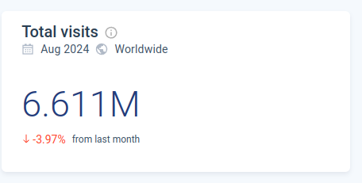

# Highload_Ozon
Расчетно-пояснительная записка к курсовой работе по дисциплине "Проектирование высоконагруженных систем"
Образовательный центр VK x МГТУ им.Н.Э.Баумана (ex. "Технопарк")

# 1. Тема и целевая аудитория
Маркетплейс Ozon - платформа, на которой продавцы могут размещать свои товары для продажи, а покупатели — приобретать их. Маркетплейс имеет широкий ассортимент товаров и предлагают удобные условия для покупки.

## Определение функционала MVP
1. Регистрация и авторизация пользователей.
2. Поиск товаров по ключевым словам.
3. Просмотр информации о товарах, включая описание, характеристики, цены и отзывы.
4. Добавление товара в корзину
5. Редактирование списка в корзине товаров.
6. Выбор пункта доставки
7. Оформление заказа
8. Выложить товар на продажу (продавец)
9. Трэккинг посылок

## Целевая аудитория
Аудитория сайта достаточно широкая и разнообразная, но, преобладающее большинство мужчины. [[1]](https://pro.similarweb.com/#/digitalsuite/websiteanalysis/overview/website-performance/*/999/1m?webSource=Total&key=ozon.ru) 
Размер целевой аудитории: 58.6 млн. пользователей в месяц, 21.0 млн. пользователей в день на момент февраля 2024г. [[2]](https://oborot.ru/news/kolichestvo-posetitelej-marketplejsov-wildberries-i-ozon-v-mesyac-sravnyalos-kuda-eshhe-hodyat-pokupateli-i209527.html) 
**Гендерное распределение**  

**Возрастное распределение**  

**География аудитории иаркетплейс Ozon** 

Можно сделать следующие выводы: 
* Преобладающее большинство пользователей мужчины
* Доминирующий возраст 25-34 года
* 95% пользователей из России

# 2. Расчёт нагрузки

## Продуктовые метрики

Метрика      | Значение
-------------| -------------
Месячная аудитория MAU        | 58.6 млн. пользователей
Дневная аудитория DAU         | 21.0 млн. пользователей
Количество регистраций в день [[3]](https://adindex.ru/news/researches/2023/02/28/310879.phtml) | 40 тыс. пользователей
Средняя длительность сессии   [[4]](https://dzen.ru/a/ZkT8wKCKkBgtJMT-) | 11 минут

### Хранилище данных для пользователя и действия пользователей
Так как общее количество заказов около 966 млн. [[5]](https://oborot.ru/news/oborot-sellerov-na-ozon-vyros-v-23-raza-skolko-u-marketplejsa-vyruchki-prodavcov-pokupatelej-i-zakazov-na-nachalo-2024-goda-i211081.html) товаров, то можно вычислить сколько в среднем один пользователь делает заказов в день:
(966 млн / 365 дней) / 21 млн = 0.13 заказа/день
Так как общее число запросов на поисковая активность в месяц около 1,007 млрд. [[6]](https://sberbusiness.live/publications/kak-pokupateli-ischut-tovar-na-marketpleisah-issledovanie-mediascope), то можно вычислить сколько в среднем один пользователь делает поисковых запросов в день:
(1,007 млрд / 30 дней) / 21 млн = 1.6 запросов/день 

Параметр          | Число
-------------| -------------
Поиск товаров по ключевым словам           | 1.6 запросов/день
Просмотр информации о товарах              | 12 [[7]](https://new-retail.ru/business/e_commerce/issledovanie_78_pokupateley_predpochitayut_izuchat_otzyvy_na_marketpleysakh/) запросов/день
Добавление товаров в корзину               | 3.1 товаров/день
Редактирование списка в корзине товаров    | 0.1 запросов/день
Выбор пункта доставки                      | 0.13 запрос/день
Оформление заказа                          | 0.13 заказов/день
Среднее количество товаров в заказе        | 3 товаров
Добавление товаров продавцом               | 0.5 товаров/день
Средний размер товара без учета фотографии | 6.3 кБ
Средний количество фотографий у товара     | 7 шт.
Средний размер фотографии товара           | 86 кБ
Трэккинг посылок                           | 0.5 запросов/день

Объём данных на одного пользователя в день:
* Добавление товаров в корзину: 3.1 товара * (6.3 кБ + 7 * 86 кБ) = 1885.7 кБ
* Оформление заказа: 3 товара * (6.3 кБ + 7 * 86 кБ) = 1824.9 кБ
* Трэккинг посылок: 0.5 запрос/день * (6.3 кБ + 86 кБ) = 46.15 кБ

Тогда общий объем товаров в день, добавляемых в корзину, оформленых в заказе, трэкинг посылок, на одного пользователя равен:
3.1 * (6.3 (кБ) + 7 * 86 (кБ)) + 3 * (6.3 (кБ) + 7 * 86 (кБ)) + 0.5 * (6.3 (кБ) + 86 (кБ)) = 3756.8 кБ = 3.8МБ

Объём данных на одного продавца в день:
* Добавление товаров продавцом: 0.5 товаров/день * (6.3 кБ + 7 * 86 кБ) = 304.2 кБ

### Динамический рост

Так как общее количество заказов около 966 млн. товаров, то можно вычислить, какой объем данных будет занят пользователями:
* Расчёт данных на товары (всего): (6.3 (кБ) + 7 * 86 (кБ)) * 966 млн. = 587.62 ТБ
* Расчёт данных только на фотографии товаров: 7 * 86 (кБ) * 966 млн. = 581.53 ТБ

### Сетевой трафик
При расчете сетевого трафика не будем учитывать запросы, связанные с регистрацией пользователей, так как они не создают ощутимую нагрузку на наш сервис.
Основная нагрузка приходится на оформление заказа, добавление в корзину, добавление товаров продавцом и трэкинг посылок.

### Предварительные расчеты:
### Трафик по видам активности на одного пользователя:
1. Поиск товаров:

* 1.6 запроса/день. Примерный объем одного запроса можно оценить в 10 кБ (запрос + ответ от сервера). Итого: 1.6 ∗ 10 кБ = 16 кБ

2. Добавление товаров в корзину:

* 3.1 товара/день. Объем данных на один товар — 3.1 * (6.3 кБ + 7 фото * 86 кБ) = 1885.7 кБ (как уже рассчитано). Итого: 1885.7 кБ

3. Оформление заказа:

* 0.13 заказ в день с 3 товарами. Итого: 3 товара * 0.13 * (6.3 кБ + 7 * 86 кБ) = 237.24 кБ. Итого: 237.24 кБ

4. Трэккинг посылок:

* 0.5 запрос/день. Примерный объем одного запроса можно оценить в 10 кБ (запрос + ответ от сервера). Итого: 0.5 * 10 = 5 кБ

5. Добавление товаров продавцом:

* 0.5 товаров/день. Примерный объем одного запроса можно оценить в 0.5 товаров/день * (6.3 кБ + 7 * 86 кБ) = 304.2 кБ. Итого: 304.2 кБ

6. Трафик на одного пользователя в день:

* 16 кБ + 1885.7 кБ + 237.24 кБ + 5 кБ = 2143.9 кБ ≈ 2.1 МБ

### Сетевой трафик по видам активности (дневная аудитория 21.0 млн. пользователей):

Пиковое значение активности пользователей(соответственно RPS тоже) приблизительно в 3 раза выше среднего значения. Возьмем коэффициент запаса равный 4

Тип                           | Отправка (дневная аудитория 21.0 млн ппокупателей и 400 тыс продавцов [[6]](https://seller.ozon.ru/media/boost/kak-izmenilsya-biznes-portret-prodavca-ozon-v-2023-godu/)) | Отправка Гб/сек     | Пиковое значение  | Значение с коэффициентом запаса 4 |
-------------                 |---------------------------------------------------------------------------------------------------------------------------------------------------------------------------|---------------------|-------------------|-----------------------------------|
Поиск товаров                 | 21.0 млн * 16 кБ = 336 ГБ                                                                                                                                                 | 0.0039              | 0.0117            | 0.0156                            |
Добавление товаров в корзину  | 21.0 млн * 1885.7 кБ = 39 600 ГБ                                                                                                                                          | 0.458               | 1.374             | 1.832                             |
Оформление заказа             | 21.0 млн * 237.24 кБ = 4 982 ГБ                                                                                                                                           | 0.058               | 0.174             | 0.232                             |
Трэккинг посылок              | 21.0 млн * 5 кБ = 105 ГБ                                                                                                                                                  | 0.0012              | 0.0036            | 0.0048                            |
Добавление товаров продавцом  | 0.4 млн * 304.2 кБ = 121.7 ГБ                                                                                                                                             | 0.0014              | 0.0042            | 0.0056                            |
Итого                         | Покупатель: 45 023 ГБ ≈ 45 ТБ     Продавец: 121.7 ГБ                                                                                                                  | 0.519   0.0014  | 1.56   0.0042 | 2.08   0.0056                 |

### RPS
* Регистрация и авторизация пользователей: 40 тыс / 86400 = 0.5 RPS
* Поиск товаров: 21.0 млн * 1.6 / 86400 = 388.9 RPS
* Просмотр информации о товарах: 21.0 млн * 12 / 86400 = 2 917 RPS
* Добавление товаров в корзину: 21.0 млн * 3.1 / 86400 = 753.5 RPS
* Редактирование списка в корзине товаров: 21.0 млн * 0.1 / 86400 = 24.3 RPS
* Выбор пункта доставки: 21.0 млн * 0.13 / 86400 = 31.6 RPS
* Оформление заказов: 21.0 млн. * 0.13 / 86400 = 31.6 RPS
* Трэккинг посылок: 21.0 млн. * 0.5 / 86400 = 121.5 RPS
* Добавление товаров продавцом: 21.0 млн. * 0.5 / 86400 = 121.5 RPS

Действие                                | RPS        | Пиковое значение | Пиковое значение с коэффициентом запаса 4 |
------------------------------------    |------------|------------------|-------------------------------------------|
Регистрация и авторизация пользователей | 0.5        | 1.5              |                                           |
Поиск товаров                           | 388.9      | 1 166.7          | 1 555.6                                   |
Просмотр информации о товарах           | 2 917      | 8 751            | 11 668                                    |
Добавление товаров в корзину            | 753.5      | 2 260.5          | 3 014                                     |
Редактирование списка в корзине товаров | 24.3       | 72.9             | 97.2                                      |
Выбор пункта доставки                   | 31.6       | 94.8             | 126.4                                     |
Оформление заказов                      | 31.6       | 94.8             | 126.4                                     |
Трэкинг посылок                         | 121.5      | 364.5            | 486                                       |
Добавление товаров продавцом            | 121.5      | 364.5            | 486                                       |
**Итого**                               | 4390   | 13 171           | 17 561                                    |

# 3. Глобальная балансировка

### Разбиение по доменам

Будем считать, что домены по типу www.ozon.com работает на раздачу фронтенда, а бекенд распределён по поддоменам, которые будут рассмотрены далее.

- **ozon.ru**  
  Основной домен для российского сегмента Ozon, предоставляющий доступ к основному функционалу платформы.  
  
- **ozon.com**  
  Домен для международной версии Ozon, ориентированной на аудиторию за пределами России.  
  
- **ozon.kz**  
  Домен для казахстанского сегмента Ozon, адаптированный под особенности местного рынка.  
  
- **ozon.by**  
  Домен для белорусского сегмента Ozon, адаптированный под потребности белорусского рынка.  
  

### Расположение ЦОДов
Ozon работает в несккольких странах, поэтому ЦОДы не следует сосредотачивать в одной стране. Тем не менее, объём трафика из разных регионов сильно различается. Чтобы определить основных потребителей трафика, стоит обратиться с скриншотам выше.
Большой объём трафика приходится на домен ozon.ru, это около 412.7 / (412.7 + 1.103 + 14.18 + 6.611) * 100% = 95%. Следовательно расположение ЦОДов будем определять преимущественно в России.

Таким образом получаем, что ЦОДы можно расположить в следующих локациях:

- Москва
- Санкт-Петербург
- Екатеринбург
- Ростов-на-Дону
- Иркутск
- Владивосток

Посмотреть на интерактивной карте: https://yandex.ru/maps/?um=constructor%3Ad1104bd74ccac98183303bb820f37407d2142a6cde52aefb09563453659e8e32&source=constructorLink
Список был составлен на основе не только основных потребителей трафика, но и основных точек присутствия провайдеров и подводных магистральных сетей. Нужно понимать, что разные сервера могут держать на себе различные сервисы. Так, список выше подходит для размещения серверов с основной логикой платформы; для CDN же этот список стоит значительно расширить, но в рамках работы будем считать, что CDN расположены там же.
Таким образом, при таком списке мы получим снижение латентности и улучшим доступность платформы.

### Схема DNS-балансировки
За счёт географических масштабов проекта здесь будет применяться GeoDNS

# Список источников

1. https://pro.similarweb.com/#/digitalsuite/websiteanalysis/overview/website-performance/*/999/1m?webSource=Total&key=ozon.ru
2. https://oborot.ru/news/kolichestvo-posetitelej-marketplejsov-wildberries-i-ozon-v-mesyac-sravnyalos-kuda-eshhe-hodyat-pokupateli-i209527.html
3. https://adindex.ru/news/researches/2023/02/28/310879.phtml
4. https://dzen.ru/a/ZkT8wKCKkBgtJMT-
5. https://oborot.ru/news/oborot-sellerov-na-ozon-vyros-v-23-raza-skolko-u-marketplejsa-vyruchki-prodavcov-pokupatelej-i-zakazov-na-nachalo-2024-goda-i211081.html
6. https://sberbusiness.live/publications/kak-pokupateli-ischut-tovar-na-marketpleisah-issledovanie-mediascope
7. https://new-retail.ru/business/e_commerce/issledovanie_78_pokupateley_predpochitayut_izuchat_otzyvy_na_marketpleysakh/